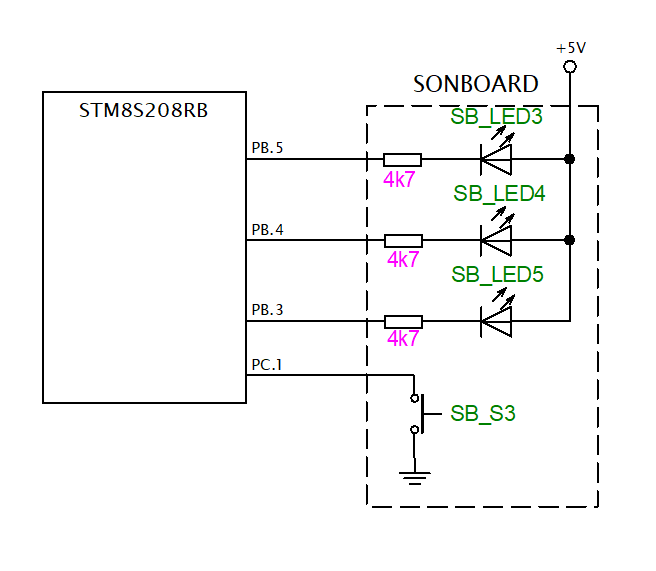

Tim3 project
===========================
Účel/Zadání/Funkce:

Pomocí přerušení 16b TIMERu (TIM2, TIM3) nastavte půlperiodu blikání LED diody na přesně 400 ms.
Pomocí tlačítka (reaguje na hranu) přepínejte mezi třemi různými LED. Tedy: tlačítko vybírá, která LED bliká.
Zajistěte, že po přepnutí na další LED, předchozí LED zhasne. Rovněž zajistěte, že blikání bude plynulé -- tedy že rozsvícení a zhasnutí LED proběhne vždy ne při stisku tlačítka, ale v pevném časovém rámci, který je dán půlperiodou 400 ms.

Schema

Popis funkce
-----------------------

1. Timer (ISR): Každých 400 ms vyvolá přerušení a přepne stav LED podle aktuálního indexu.

2. Přepínač: Detekuje náběžnou hranu tlačítka a s millis() řeší 30ms debounce (odrušení).

3. Ukazatel: Proměnná uint8_t led_pointer určuje aktivní LED v rozsahu 0 až 2.

4. Cyklení: Po dosažení hodnoty 2 se ukazatel automaticky vrací na 0 pro nekonečnou smyčku.

Zhodnocení

Timer byl pro me jednodusi nez uart a jedina chyba ktera se mi stala byla ta ze jsem chtel rozblikat LED diody 1 a 2 ktere ale nebyli zapojeny takze mi to nefungovalo a ja zmatkoval, potom mi to spoluzak vysvetlil a kod bez problemu fungoval.

Ochotnotil bych bych tuhle praci mezi vybornym a chvalitebnym.